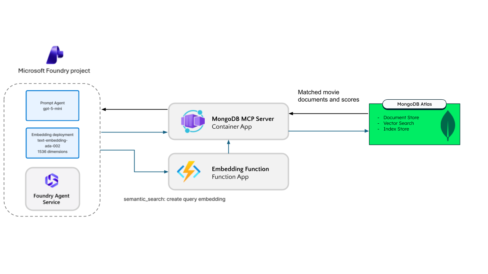

# Get started with Foundry Agent and Azure Native MongoDB Atlas powered RAG

**Note**: With any AI solutions you create using these templates, you are responsible for assessing all associated risks, and for complying with all applicable laws and safety standards. This is not meant to be an example of perfect code to be used in production, but more of a getting started sample.

## Solution Overview

This automated single script-based solution will build a **Microsoft Foundry agent** that performs semantic search over **MongoDB Atlas** sample movie data. This simple solution leverages the MongoDB MCP local Server which is available in Foundry tool catalog to connect Foundry Agent to Atlas databases.

This is full automated which means that you don't need to setup anything other than login to Azure and MongoDB Atlas, which you will be prompted to during the runtime.

Instructions are provided for deployment through GitHub Codespaces and your local development environment.

## What You'll Build

A Microsoft Foundry native agent that can perform search and aggregations on your Atlas Database. You can ask the agent to perform:
- **Semantic Search**: Find documents by meaning, not just keywords ("movies about hope and redemption")
- **Direct Queries**: Filter by specific fields (year, genre, cast)
- **Aggregations**: Get statistics, top results, counts

## Architecture




The agent registers **one** MCP server, the Function, which advertises `semantic_search` plus every tool the
MongoDB MCP server offers. Calls that are not `semantic_search` are relayed to that MCP server untouched, so the
MongoDB MCP server performs all database operations and is the only component holding the connection string. The
Function has no MongoDB driver and no credential and is only used for embedding the user query. See [docs/architecture.md](./docs/architecture.md) for detail.

## Prerequisites

- [Azure Subscription](https://azure.microsoft.com/free/) with two things:
  - **Owner** or **Contributor**, to create the MongoDB Atlas resource, a resource group, Function, Container App, and Foundry account
  - **Azure AI User** (shown as **Foundry User** in the Microsoft Foundry portal), assigned at **subscription**
    scope. Owner and Contributor are control-plane roles and do **not** grant the Foundry data plane, so without
    this the script provisions everything and then fails on the last step with a 401 when it tries to create the
    agent. Assigning it at the subscription level means it covers the Foundry account the script creates for you.
    If your organization uses PIM, this role may be *eligible* rather than active, in which case activate it before
    you start (it will not show up in `az role assignment list` until you do).
- [Azure CLI](https://docs.microsoft.com/cli/azure/install-azure-cli) (run `az login` first)
- [Atlas CLI](https://www.mongodb.com/docs/atlas/cli/current/install-atlas-cli/)
- [PowerShell 7+](https://learn.microsoft.com/powershell/scripting/install/installing-powershell) (cross-platform: Windows, macOS, Linux)
- [An existing MongoDB Atlas Organization](https://learn.microsoft.com/en-us/azure/partner-solutions/mongo-db/create) — to be created via Azure Native Integration.

> **No Azure Functions Core Tools or local Python is required.** The deploy script uses **Flex Consumption**, which builds the function remotely, and it creates the Foundry project, model deployment, and agent for you.

## Deploy MongoDB Atlas via Azure Native Integration

You can provision MongoDB Atlas with Azure portal via the Azure Native Integration. This will let you create and manage MongoDB Atlas directly from the Azure portal, with unified billing on your Azure invoice.

#### Create MongoDB Atlas organization Resource in Azure Portal

1. Sign in to the [Azure portal](https://portal.azure.com)
2. Click **Create a resource** (or search for **MongoDB Atlas** in the top search bar)
3. Select **MongoDB Atlas (Azure Native ISV Service)** from the Marketplace results
4. Click **Create** and complete the deployment steps.
5. Once deployment is completed, you can also proceed to create Atlas Project and Cluster (optional) from the Azure portal.

#### Create MongoDB Atlas organization via Azure CLI

You can provision a new MongoDB Atlas organization via Azure CLI with the command detailed in [CLI documentation](https://learn.microsoft.com/en-us/cli/azure/mongo-db/atlas/organization?view=azure-cli-latest#az-mongo-db-atlas-organization-create).

#### Additional Resources

- [Quickstart: Create a MongoDB Atlas resource in Azure](https://learn.microsoft.com/azure/partner-solutions/mongodb-atlas/create)
- [Manage MongoDB Atlas through Azure](https://learn.microsoft.com/azure/partner-solutions/mongodb-atlas/manage)

## Deploy the sample with a single script in the environment of your choice

### Fastest path: GitHub Codespaces (zero local install)
Automated deployment script to setup Atlas and Azure side of things.

[](https://codespaces.new/mongodb-partners/Microsoft_Foundry)

> Click the badge to launch a cloud dev box with the whole toolchain preinstalled, then run one command: `./scripts/setup-and-deploy.ps1`.

Click the **Open in GitHub Codespaces** badge at the top, or use the green **Code** button on the repo, choose **Codespaces**, and **Create codespace on main**. The dev container preinstalls the Azure CLI, PowerShell, Python, Bicep, and the MongoDB Atlas CLI. Then, in the PowerShell terminal, run one command:

```powershell
./scripts/setup-and-deploy.ps1
```
You are prompted to sign in to Azure and MongoDB Atlas the first time (browser device-code login); then it sets up Atlas + Azure + the agent end to end. You can stop here.

### Share the repo with GitHub co-pilot
You can give the entire repo to GitHub co-pilot for end-to-end execution. The co-pilot will prompt you for inputs, if required.

### Or set it up manually

Running locally and want to do the pieces yourself? Install the [prerequisites](#prerequisites), then follow the numbered steps. (You can still run everything at once with `./scripts/setup-and-deploy.ps1` instead of below steps.)

### 1. Clone and navigate

```bash
git clone https://github.com/mongodb-partners/Microsoft_Foundry.git
cd Microsoft_Foundry/simple-rag-movies
```
### 2. Setup MongoDB Atlas resources

```powershell
az login
./scripts/atlas/deploy.ps1
```

### 3. Provision Azure resources

```powershell
az login
./scripts/azure/deploy.ps1
```

This one-click script provisions the **entire Azure side** in a single interactive run. The script will deploy the following resources in your Azure Subscription:

- A Resource group
- A **Microsoft Foundry resource**  with deployed models i.e. `text-embedding-ada-002` and `gpt-5-mini`.
- Embedding / vector-search **Function** on Flex Consumption for query embedding (serves the `semantic_search` MCP endpoint at `/api/mcp`)
- **MongoDB MCP Server** hosted on Azure Container Apps
- Foundry project + a **prompt agent** wired to both MCP tools

The script prompts for tenant/subscription and resource names (press Enter to accept defaults), provisions everything, and creates the agent. For unattended runs, copy [`deploy/config.example.json`](./deploy/config.example.json) to `deploy/config.json`, edit it, and run with `-NonInteractive`.

### 4. Test your agent with sample queries

Open **mongodb-search-agent** in the [Foundry playground](https://ai.azure.com) and try:

- "Find movies about hope and redemption" — routes to the `semantic_search` MCP tool (vector search)
- "Show me movies from 1994" — routes to the MongoDB MCP tool (`find`)
- "What are the top 10 highest rated sci-fi movies?" — routes to the MongoDB MCP tool (`aggregate`)

See [sample-queries.md](./sample-queries.md) for more, and [agent-instructions.md](./docs/agent-instructions.md) for the system prompt that drives tool routing.

---

## Sample Structure in this repo

```
simple-rag-movies/
├── README.md                          # This file
├── sample-queries.md                  # Example queries to test
├── src/
│   └── embedding-function/            # Azure Function for embeddings
│       ├── function_app.py
│       ├── host.json
│       └── requirements.txt
├── deploy/
│   ├── config.example.json            # Copy to config.json for -NonInteractive runs
│   ├── mcp-server/
│   │   └── main.bicep                 # MongoDB MCP Server deployment
│   └── embedding-function/
│       └── main.bicep                 # Embedding Function (Flex Consumption)
├── docs/
│   ├── architecture.md                # Detailed architecture doc
│   └── agent-instructions.md          # Agent system prompt
└── scripts/
    ├── setup-and-deploy.ps1          # One command: Atlas setup + Azure deploy (what Codespaces runs)
    ├── atlas/setup.ps1               # Automate Atlas (cluster, sample data, vector index) + set env var
    ├── atlas/verify.py               # Verify Atlas: connect, query, run a real vector search
    ├── azure/deploy.ps1              # One-click Azure deploy (infra + model + agent)
    └── azure/teardown.ps1            # Delete the resource group (keeps Atlas)
```

## Configuration Options

### Embedding Function

| Setting | Description | Default |
|---------|-------------|---------|
| `AZURE_OPENAI_ENDPOINT` | Azure OpenAI resource endpoint | Required |
| `AZURE_OPENAI_API_KEY` | Azure OpenAI API key | Required |
| `EMBEDDING_MODEL` | Embedding model deployment name | `text-embedding-ada-002` |

### MCP Server

| Setting | Description | Default |
|---------|-------------|---------|
| `MDB_MCP_CONNECTION_STRING` | MongoDB connection string | Required |
| `MDB_MCP_READ_ONLY` | Restrict to read operations | `true` |
| `MDB_MCP_HTTP_PORT` | HTTP port | `8080` |

## Cost Estimate

| Component | Tier | Estimated Cost |
|-----------|------|----------------|
| Azure Function | Flex Consumption | ~$0 (pay-per-use, scales to zero) |
| Container App (MCP) | Consumption | ~$0-5/month |
| Azure OpenAI (embeddings) | Pay-as-you-go | ~$0.0001/1K tokens |
| gpt-5-mini (agent) | Pay-as-you-go | per-call inference + tool usage |
| MongoDB Atlas | M0 | Free |
| **Total** | | **~$0-10/month for light use** |

## Cleanup

Delete everything this sample created in Azure (the resource group and all resources in it). Your MongoDB Atlas cluster is left untouched.

```powershell
./scripts/azure/teardown.ps1 -ResourceGroup <your-resource-group> -Purge
```

The script lists the resources and asks you to type the resource group name to confirm. `-Purge` also frees the globally-unique Foundry account name immediately, so you can redeploy with the same name.

## Troubleshooting

### "Embedding generation failed"
- Verify `AZURE_OPENAI_ENDPOINT` and `AZURE_OPENAI_API_KEY` are set
- Check the embedding model deployment name matches `EMBEDDING_MODEL`
- Ensure the model is deployed in your Azure OpenAI resource

### "MongoDB connection failed"
- Verify the connection string includes username and password
- Check MongoDB Atlas network access allows Azure IPs (or use 0.0.0.0/0 for testing at the cost of high-risk)
- Ensure the MCP server container is running

### "Vector search returned no results"
- Verify the `vector_index` exists on `embedded_movies` collection
- Check the index status is "Active" in Atlas
- Ensure you're using the correct field name (`plot_embedding`)

## Resources

- [Azure AI Foundry Documentation](https://learn.microsoft.com/azure/ai-studio/)
- [Azure Native MongoDB Atlas](https://learn.microsoft.com/en-us/azure/partner-solutions/mongo-db/create)
- [MongoDB Atlas Vector Search](https://www.mongodb.com/docs/atlas/atlas-vector-search/vector-search-overview/)
- [MCP (Model Context Protocol)](https://modelcontextprotocol.io/)
- [Azure Functions Python Guide](https://learn.microsoft.com/azure/azure-functions/functions-reference-python)
